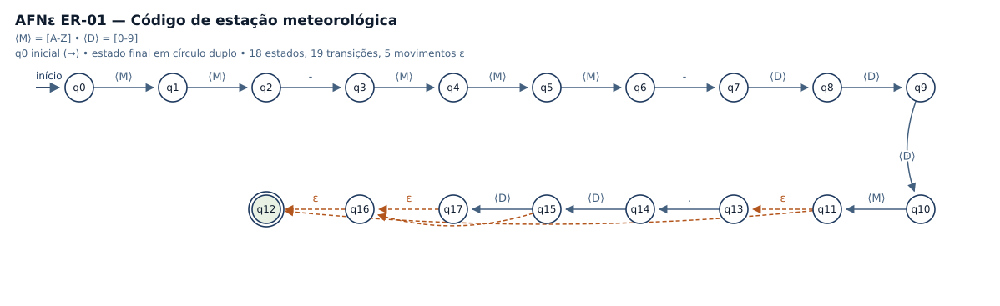
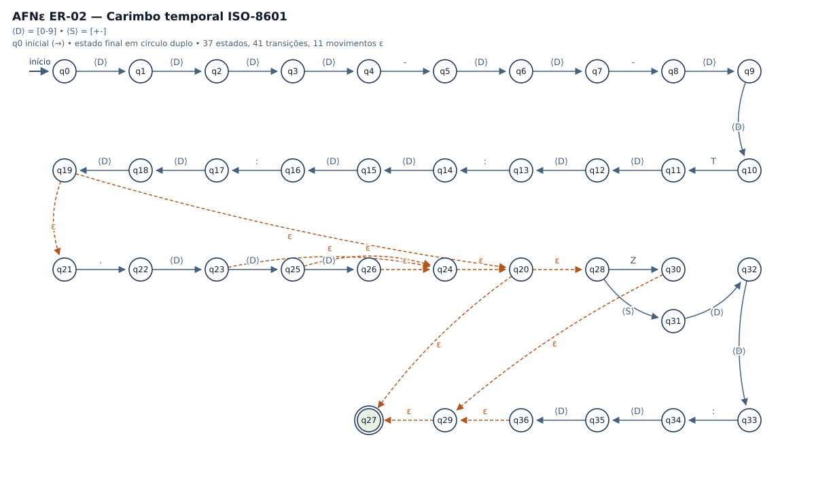
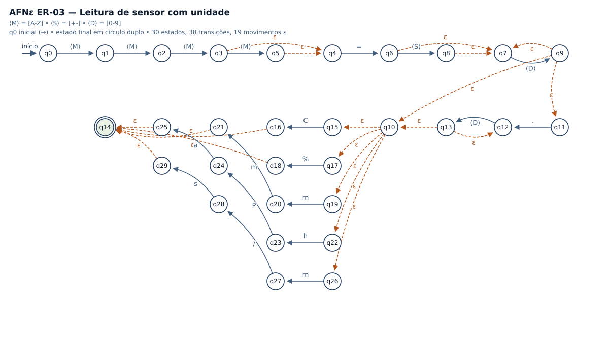
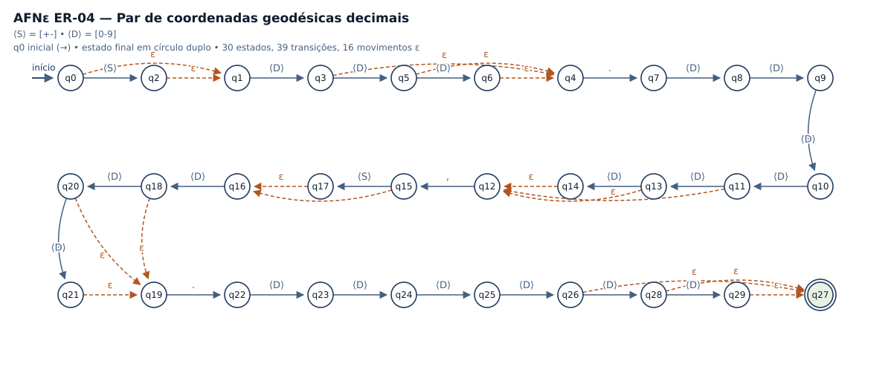
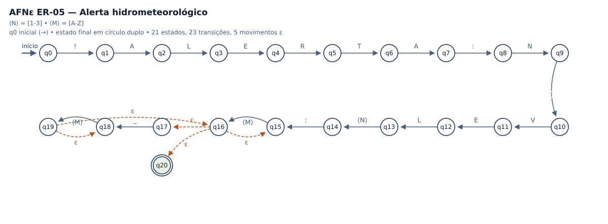
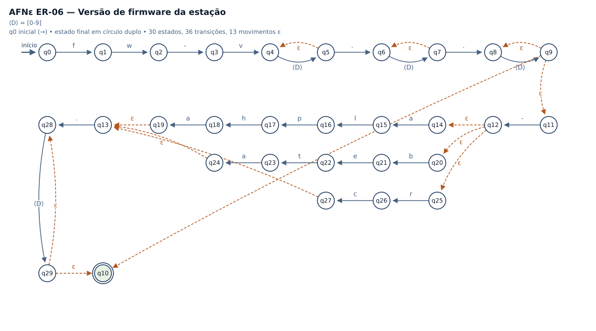

# Expressões Regulares do MeteoRegex

> Documento **gerado automaticamente** por `ferramentas/gerar_documentacao.py`
> a partir do código-fonte (`analisador/expressoes.py` e
> `analisador/automatos.py`). Qualquer alteração no programa se reflete aqui,
> o que garante a exigência do enunciado: *a expressão formal, a expressão da
> apresentação, o padrão implementado, os testes e o AFNε representam a mesma
> linguagem*.

Motor de Expressões Regulares: módulo `re` da biblioteca padrão do Python 3.
Toda validação usa `re.fullmatch`, isto é, a **cadeia inteira** precisa
pertencer à linguagem — nenhum casamento parcial é aceito.

Recursos deliberadamente **não utilizados** (seção 4 do guia de sintaxe):
retroreferências, recursão, condicionais e lookaround. Todos os agrupamentos
são não capturantes `(?:r)`, equivalentes ao agrupamento formal `( r )`.

| ER | Nome | Campo do registro | Estados do AFNε | Movimentos ε |
|----|------|-------------------|-----------------|--------------|
| ER-01 | Código de estação meteorológica | campo 1 do registro de telemetria | 18 | 5 |
| ER-02 | Carimbo temporal ISO-8601 | campo 2 do registro de telemetria | 37 | 11 |
| ER-03 | Leitura de sensor com unidade | campo 4 do registro (itens separados por ';') | 30 | 19 |
| ER-04 | Par de coordenadas geodésicas decimais | campo 3 do registro de telemetria | 30 | 16 |
| ER-05 | Alerta hidrometeorológico | campo 6 (opcional) do registro de telemetria | 21 | 5 |
| ER-06 | Versão de firmware da estação | campo 5 do registro de telemetria | 30 | 13 |


---

## ER-01 — Código de estação meteorológica

**Finalidade no programa.** Validar o identificador da estação que originou o registro e permitir agrupar as leituras por estação e por sub-estação.

**Onde é aplicada.** campo 1 do registro de telemetria

### Alfabeto (Σ)

```
Σ₁ = M ∪ D ∪ { '-', '.' }, com M = {A, B, ..., Z} e D = {0, 1, ..., 9}
```

### Linguagem reconhecida (L)

Cadeias formadas por duas letras maiúsculas (sigla da UF), um hífen, três letras maiúsculas (código do município), um hífen, três dígitos (número sequencial da estação) e uma letra maiúscula (revisão do hardware), seguidas opcionalmente de um ponto e de um ou dois dígitos que identificam a sub-estação.

### Expressão Regular na notação formal

```
M M - M M M - D D D M ( . D ( D | ε ) | ε )
forma abreviada: M{2} - M{3} - D{3} M ( . D{1,2} )?
```

### Sintaxe exatamente como aparece no código-fonte

```python
r"[A-Z]{2}-[A-Z]{3}-[0-9]{3}[A-Z](?:\.[0-9]{1,2})?"
```

### Equivalência entre os atalhos e os operadores formais

- `[A-Z]  ≡  (A | B | ... | Z)  = classe M`
- `[0-9]  ≡  (0 | 1 | ... | 9)  = classe D`
- `r{2}   ≡  r r   (concatenação de 2 cópias)`
- `r{3}   ≡  r r r (concatenação de 3 cópias)`
- `r{1,2} ≡  (r | r r)`
- `(?:r)? ≡  ( r | ε )`
- `\.     ≡  símbolo literal '.' (o escape remove o significado especial)`

### Explicação dos operadores utilizados

- concatenação: impõe a ordem rígida dos blocos do identificador;
- classe/intervalo: abreviação da união dos símbolos do alfabeto;
- repetição exata {m}: concatenação de m cópias;
- repetição limitada {1,2}: união de uma e de duas cópias;
- opcionalidade ?: união com a palavra vazia ε (sufixo de sub-estação).

### AFNε correspondente



- estado inicial: `q0`
- estados finais: `q12`
- total de estados: 18
- total de transições: 19
- movimentos vazios (ε): 5

A descrição formal completa (Q, Σ, δ, q₀, F) está em [`afne_formal.md`](afne_formal.md) e pode ser exibida pelo programa com `python main.py -f -e ER-01 --afne`.

### Testes

| # | Cadeia aceita | Cadeia rejeitada |
|---|---------------|------------------|
| 1 | `PA-BEL-004A` | `pa-bel-004a` |
| 2 | `PA-ANA-127B` | `PA-BE-004A` |
| 3 | `AM-MAO-001A` | `PA-BEL-04A` |
| 4 | `PA-BEL-004A.2` | `PA-BEL-004` |
| 5 | `RJ-RIO-999Z.15` | `PA-BEL-004A.` |
| 6 | `SP-SAO-000A.1` | `PA-BEL-004A.123` |

**Caso-limite.** "PA-BEL-004A." — prefixo válido seguido do ponto sem nenhum dígito: o fecho opcional exige que, havendo o ponto, exista ao menos um dígito. Caso-limite oposto: "PA-BEL-004A" (sufixo ausente, ramo ε) é aceito.

**Resultado observado e limitações.** A ER valida apenas a FORMA do código. Não verifica se a sigla é uma UF existente nem se a estação está cadastrada: "ZZ-XXX-000A" é formalmente aceita. Essa verificação semântica é feita depois, por consulta à lista de estações conhecidas.


---

## ER-02 — Carimbo temporal ISO-8601

**Finalidade no programa.** Validar o instante da coleta, com fração de segundo e fuso horário opcionais, permitindo ordenar cronologicamente os registros.

**Onde é aplicada.** campo 2 do registro de telemetria

### Alfabeto (Σ)

```
Σ₂ = D ∪ { '-', 'T', ':', '.', 'Z', '+' }, com D = {0, 1, ..., 9}
```

### Linguagem reconhecida (L)

Cadeias no formato AAAA-MM-DDThh:mm:ss, opcionalmente seguidas de um ponto e de 1 a 3 dígitos (milissegundos) e, opcionalmente, de um indicador de fuso: a letra Z (UTC) ou um sinal seguido de hh:mm.

### Expressão Regular na notação formal

```
D{4} - D{2} - D{2} T D{2} : D{2} : D{2} ( . D ( D ( D | ε ) | ε ) | ε ) ( Z | ( + | - ) D{2} : D{2} | ε )
```

### Sintaxe exatamente como aparece no código-fonte

```python
r"[0-9]{4}-[0-9]{2}-[0-9]{2}T[0-9]{2}:[0-9]{2}:[0-9]{2}(?:\.[0-9]{1,3})?(?:Z|[+-][0-9]{2}:[0-9]{2})?"
```

### Equivalência entre os atalhos e os operadores formais

- `[0-9]     ≡ (0 | 1 | ... | 9) = classe D`
- `r{4}      ≡ r r r r`
- `r{1,3}    ≡ (r | r r | r r r)`
- `[+-]      ≡ (+ | -)  — dentro da classe o '-' está na borda e é literal`
- `(?:r)?    ≡ ( r | ε )`
- `(?:a|b)   ≡ união a | b`

### Explicação dos operadores utilizados

- concatenação: fixa a ordem data → 'T' → hora;
- repetição exata {m}: blocos de tamanho fixo (ano, mês, dia, hora…);
- repetição limitada {1,3}: fração de segundo de 1 a 3 dígitos;
- união |: escolhe entre fuso 'Z' e deslocamento ±hh:mm;
- opcionalidade ?: dois sufixos independentes podem ser ε.

### AFNε correspondente



- estado inicial: `q0`
- estados finais: `q27`
- total de estados: 37
- total de transições: 41
- movimentos vazios (ε): 11

A descrição formal completa (Q, Σ, δ, q₀, F) está em [`afne_formal.md`](afne_formal.md) e pode ser exibida pelo programa com `python main.py -f -e ER-02 --afne`.

### Testes

| # | Cadeia aceita | Cadeia rejeitada |
|---|---------------|------------------|
| 1 | `2026-09-21T14:35:02` | `2026-09-21 14:35:02` |
| 2 | `2026-09-21T14:35:02Z` | `26-09-21T14:35:02` |
| 3 | `2026-09-21T14:35:02.5` | `2026-09-21T14:35` |
| 4 | `2026-09-21T14:35:02.123-03:00` | `2026-09-21T14:35:02.` |
| 5 | `2026-01-01T00:00:00+00:00` | `2026-09-21T14:35:02.1234` |
| 6 | `1999-12-31T23:59:59.999Z` | `2026-09-21T14:35:02-0300` |

**Caso-limite.** "2026-09-21T14:35:02." — a parte obrigatória está completa, mas o ponto abre uma fração vazia; como {1,3} exige pelo menos um dígito, a cadeia é rejeitada. O caso-limite aceito correspondente é "2026-09-21T14:35:02" (ambos os sufixos opcionais em ε).

**Resultado observado e limitações.** A ER reconhece a ESTRUTURA do carimbo, não a validade do calendário: "2026-13-45T99:99:99" é aceita pela ER. Datas impossíveis são descartadas na etapa seguinte, por conversão com datetime.


---

## ER-03 — Leitura de sensor com unidade

**Finalidade no programa.** Validar e extrair cada par grandeza=valor+unidade produzido pelos sensores da estação, base de todo o cálculo estatístico do programa.

**Onde é aplicada.** campo 4 do registro (itens separados por ';')

### Alfabeto (Σ)

```
Σ₃ = M ∪ D ∪ { '=', '+', '-', '.', '%', 'm', 'h', 'P', 'a', '/', 's', 'C' }
```

### Linguagem reconhecida (L)

Cadeias compostas por uma sigla de 3 ou 4 letras maiúsculas, o símbolo '=', um número decimal com sinal opcional e parte fracionária opcional, e uma unidade pertencente a { C, %, mm, hPa, m/s }.

### Expressão Regular na notação formal

```
M M M ( M | ε ) = ( + | - | ε ) D D* ( . D D* | ε ) ( C | % | m m | h P a | m / s )
```

### Sintaxe exatamente como aparece no código-fonte

```python
r"[A-Z]{3,4}=[+-]?[0-9]+(?:\.[0-9]+)?(?:C|%|mm|hPa|m/s)"
```

### Equivalência entre os atalhos e os operadores formais

- `[A-Z]{3,4} ≡ M M M ( M | ε )`
- `[+-]?      ≡ ( + | - | ε )`
- `[0-9]+     ≡ D D*  (fecho positivo = uma cópia seguida do fecho de Kleene)`
- `(?:\.[0-9]+)? ≡ ( . D D* | ε )`
- `(?:C|%|mm|hPa|m/s) ≡ união de cinco cadeias literais`

### Explicação dos operadores utilizados

- fecho positivo +: a parte inteira tem pelo menos um dígito;
- fecho de Kleene *: implícito na expansão de + (D D*);
- opcionalidade ?: sinal e parte fracionária podem ser ε;
- união |: escolhe a unidade de medida;
- concatenação: amarra sigla, '=', número e unidade.

### AFNε correspondente



- estado inicial: `q0`
- estados finais: `q14`
- total de estados: 30
- total de transições: 38
- movimentos vazios (ε): 19

A descrição formal completa (Q, Σ, δ, q₀, F) está em [`afne_formal.md`](afne_formal.md) e pode ser exibida pelo programa com `python main.py -f -e ER-03 --afne`.

### Testes

| # | Cadeia aceita | Cadeia rejeitada |
|---|---------------|------------------|
| 1 | `TEMP=+27.4C` | `TEMP=27.4` |
| 2 | `UMID=85%` | `TE=27C` |
| 3 | `PLUV=0.0mm` | `TEMPER=27C` |
| 4 | `PRES=1012.75hPa` | `TEMP=.5C` |
| 5 | `VENT=3.2m/s` | `TEMP=27.C` |
| 6 | `TEMP=-0C` | `temp=27C` |

**Caso-limite.** "TEMP=.5C" — número sem parte inteira: o fecho positivo [0-9]+ exige ao menos um dígito antes do ponto, logo a cadeia é rejeitada. O caso-limite aceito é "TEMP=-0C", número mínimo com sinal e sem parte fracionária.

**Resultado observado e limitações.** A ER não impõe faixa física: "TEMP=+999.9C" é aceita. A checagem de plausibilidade (faixas por grandeza) é feita no módulo processador, que sinaliza a leitura como suspeita sem invalidar o registro.


---

## ER-04 — Par de coordenadas geodésicas decimais

**Finalidade no programa.** Validar a posição informada pela estação (latitude e longitude em graus decimais com sinal), usada no agrupamento geográfico do relatório.

**Onde é aplicada.** campo 3 do registro de telemetria

### Alfabeto (Σ)

```
Σ₄ = D ∪ { '+', '-', '.', ',' }, com D = {0, 1, ..., 9}
```

### Linguagem reconhecida (L)

Dois números decimais separados por vírgula; cada número possui sinal opcional, de 1 a 3 dígitos inteiros, ponto obrigatório e de 4 a 6 casas decimais.

### Expressão Regular na notação formal

```
N , N, onde N = ( + | - | ε ) D ( D ( D | ε ) | ε ) . D D D D ( D ( D | ε ) | ε )
forma abreviada: N = ( + | - )? D{1,3} . D{4,6}
```

### Sintaxe exatamente como aparece no código-fonte

```python
r"[+-]?[0-9]{1,3}\.[0-9]{4,6},[+-]?[0-9]{1,3}\.[0-9]{4,6}"
```

### Equivalência entre os atalhos e os operadores formais

- `[+-]?      ≡ ( + | - | ε )`
- `[0-9]{1,3} ≡ ( D | D D | D D D )`
- `[0-9]{4,6} ≡ ( D{4} | D{5} | D{6} )`
- `\.         ≡ símbolo literal '.'`
- `','        ≡ símbolo literal ','`

### Explicação dos operadores utilizados

- repetição limitada {m,n}: união das repetições de m até n cópias;
- opcionalidade ?: o sinal pode ser ε (coordenada positiva);
- concatenação: latitude, vírgula e longitude, nessa ordem;
- escape \. : garante que o ponto seja símbolo do alfabeto e não o curinga do motor.

### AFNε correspondente



- estado inicial: `q0`
- estados finais: `q27`
- total de estados: 30
- total de transições: 39
- movimentos vazios (ε): 16

A descrição formal completa (Q, Σ, δ, q₀, F) está em [`afne_formal.md`](afne_formal.md) e pode ser exibida pelo programa com `python main.py -f -e ER-04 --afne`.

### Testes

| # | Cadeia aceita | Cadeia rejeitada |
|---|---------------|------------------|
| 1 | `-1.455833,-48.503889` | `-1.455833` |
| 2 | `+1.4558,-48.5038` | `-1.45,-48.50` |
| 3 | `0.0000,0.0000` | `-1455833,-48503889` |
| 4 | `-23.550520,-46.633308` | `-1.455833;-48.503889` |
| 5 | `90.000000,180.000000` | `-1.4558333,-48.5038` |
| 6 | `-1.4558,48.5038` | `-1.4558, -48.5038` |

**Caso-limite.** "-1.45,-48.50" — coordenada plausível, porém com 2 casas decimais: a repetição {4,6} exige no mínimo 4, e a cadeia é rejeitada. O caso-limite aceito é "0.0000,0.0000" (mínimo de dígitos inteiros e de casas decimais, sem sinal).

**Resultado observado e limitações.** A ER não restringe a faixa geográfica: "999.0000,999.0000" seria aceita se tivesse 3 dígitos inteiros. A validação de faixa (|lat| ≤ 90, |lon| ≤ 180) é numérica e ocorre após o reconhecimento.


---

## ER-05 — Alerta hidrometeorológico

**Finalidade no programa.** Reconhecer o campo opcional de alerta, extraindo o nível de severidade e o código do evento para o painel de ocorrências.

**Onde é aplicada.** campo 6 (opcional) do registro de telemetria

### Alfabeto (Σ)

```
Σ₅ = M ∪ { '!', ':', '_', '1', '2', '3' }, com M = {A, ..., Z}
```

### Linguagem reconhecida (L)

Cadeias iniciadas por "!ALERTA:NIVEL", seguidas de um dígito de 1 a 3, de ':' e de um código formado por uma ou mais palavras de letras maiúsculas separadas por sublinhado.

### Expressão Regular na notação formal

```
! A L E R T A : N I V E L ( 1 | 2 | 3 ) : P ( _ P )*, onde P = M M*
```

### Sintaxe exatamente como aparece no código-fonte

```python
r"!ALERTA:NIVEL[1-3]:[A-Z]+(?:_[A-Z]+)*"
```

### Equivalência entre os atalhos e os operadores formais

- `'!ALERTA:NIVEL' ≡ concatenação de símbolos literais`
- `[1-3]  ≡ ( 1 | 2 | 3 )`
- `[A-Z]+ ≡ M M*  (fecho positivo)`
- `(?:_[A-Z]+)* ≡ ( _ M M* )*  (fecho de Kleene, inclui ε)`

### Explicação dos operadores utilizados

- concatenação: prefixo fixo do alerta;
- intervalo [1-3]: união dos três níveis de severidade;
- fecho positivo +: cada palavra tem ao menos uma letra;
- fecho de Kleene *: zero ou mais palavras adicionais, o que inclui a palavra vazia ε (código de uma só palavra).

### AFNε correspondente



- estado inicial: `q0`
- estados finais: `q20`
- total de estados: 21
- total de transições: 23
- movimentos vazios (ε): 5

A descrição formal completa (Q, Σ, δ, q₀, F) está em [`afne_formal.md`](afne_formal.md) e pode ser exibida pelo programa com `python main.py -f -e ER-05 --afne`.

### Testes

| # | Cadeia aceita | Cadeia rejeitada |
|---|---------------|------------------|
| 1 | `!ALERTA:NIVEL1:CHUVA` | `ALERTA:NIVEL1:CHUVA` |
| 2 | `!ALERTA:NIVEL2:CHUVA_FORTE` | `!ALERTA:NIVEL4:CHUVA` |
| 3 | `!ALERTA:NIVEL3:VENDAVAL_COM_DESCARGAS` | `!ALERTA:NIVEL2:chuva` |
| 4 | `!ALERTA:NIVEL3:A` | `!ALERTA:NIVEL2:` |
| 5 | `!ALERTA:NIVEL2:MARE_ALTA_DE_SIZIGIA` | `!ALERTA:NIVEL2:CHUVA_` |
| 6 | `!ALERTA:NIVEL1:CALOR` | `!ALERTA:NIVEL2:CHUVA FORTE` |

**Caso-limite.** "!ALERTA:NIVEL2:" — prefixo completo e código vazio: o fecho positivo [A-Z]+ impede a cadeia vazia, logo há rejeição. O caso-limite aceito é "!ALERTA:NIVEL3:A", com o menor código possível (uma única letra e o fecho de Kleene em ε).

**Resultado observado e limitações.** Qualquer código de evento em maiúsculas é aceito, inclusive códigos inexistentes no catálogo da Defesa Civil. O programa compara o código com um catálogo interno e marca como DESCONHECIDO quando não o encontra.


---

## ER-06 — Versão de firmware da estação

**Finalidade no programa.** Validar a versão do firmware embarcado e distinguir versões estáveis de versões de pré-lançamento no relatório de manutenção.

**Onde é aplicada.** campo 5 do registro de telemetria

### Alfabeto (Σ)

```
Σ₆ = D ∪ { 'f', 'w', 'v', '-', '.', 'a', 'l', 'p', 'h', 'b', 'e', 't', 'r', 'c' }
```

### Linguagem reconhecida (L)

Cadeias iniciadas pelo prefixo literal "fw-v", seguidas de três números inteiros separados por ponto (maior.menor.correção) e, opcionalmente, de um rótulo de pré-lançamento formado por '-', uma das palavras alpha, beta ou rc, um ponto e um número.

### Expressão Regular na notação formal

```
f w - v D D* ( . D D* ){2} ( - ( a l p h a | b e t a | r c ) . D D* | ε )
```

### Sintaxe exatamente como aparece no código-fonte

```python
r"fw-v[0-9]+(?:\.[0-9]+){2}(?:-(?:alpha|beta|rc)\.[0-9]+)?"
```

### Equivalência entre os atalhos e os operadores formais

- `'fw-v' ≡ concatenação de símbolos literais`
- `[0-9]+ ≡ D D*`
- `(?:\.[0-9]+){2} ≡ ( . D D* ) ( . D D* )`
- `(?:alpha|beta|rc) ≡ união de três cadeias literais`
- `(?:...)? ≡ ( ... | ε )`

### Explicação dos operadores utilizados

- concatenação: prefixo e blocos numéricos;
- fecho positivo +: cada número tem ao menos um dígito;
- repetição exata {2}: duplica o bloco '.número';
- união |: seleciona o tipo de pré-lançamento;
- opcionalidade ?: versões estáveis não possuem rótulo (ramo ε).

### AFNε correspondente



- estado inicial: `q0`
- estados finais: `q10`
- total de estados: 30
- total de transições: 36
- movimentos vazios (ε): 13

A descrição formal completa (Q, Σ, δ, q₀, F) está em [`afne_formal.md`](afne_formal.md) e pode ser exibida pelo programa com `python main.py -f -e ER-06 --afne`.

### Testes

| # | Cadeia aceita | Cadeia rejeitada |
|---|---------------|------------------|
| 1 | `fw-v3.11.2` | `fw-v3.11` |
| 2 | `fw-v0.0.1` | `fw-v3.11.2.4` |
| 3 | `fw-v12.0.45` | `v3.11.2` |
| 4 | `fw-v3.11.2-beta.4` | `fw-v3.11.2-beta` |
| 5 | `fw-v2.7.0-rc.1` | `fw-v3.11.2-gamma.1` |
| 6 | `fw-v1.0.0-alpha.12` | `FW-V3.11.2` |

**Caso-limite.** "fw-v3.11" — versão com apenas dois componentes: a repetição exata {2} exige dois blocos '.número' após o primeiro número, e a cadeia é rejeitada. O caso-limite aceito é "fw-v0.0.1", a menor versão possível, com um dígito em cada bloco e sem rótulo.

**Resultado observado e limitações.** A ER não compara versões: "fw-v0.0.1" e "fw-v12.0.45" são igualmente aceitas. A ordenação por recência é feita convertendo os blocos em inteiros após o reconhecimento.
